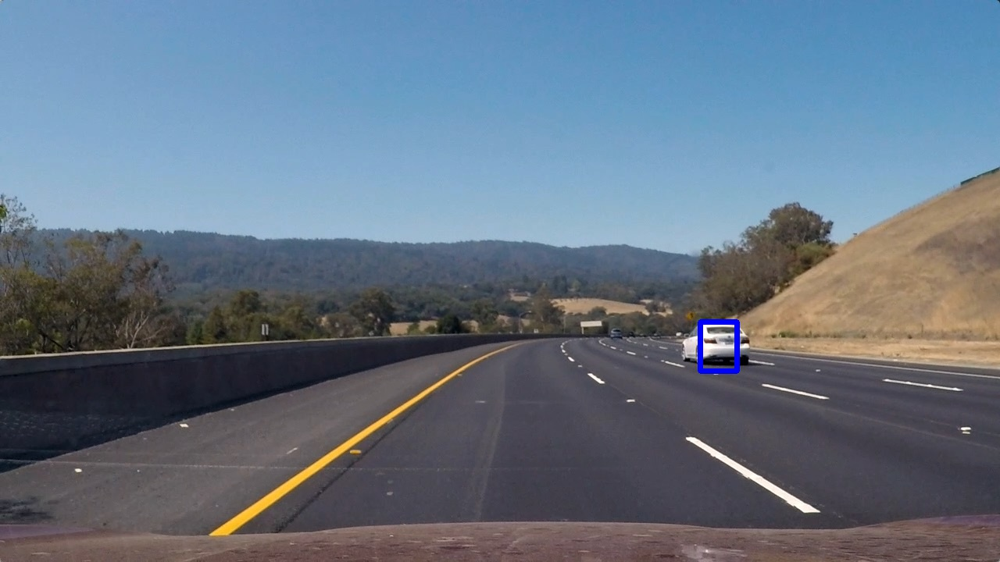

**Vehicle Detection Project**

The goals / steps of this project are the following:

* Perform a Histogram of Oriented Gradients (HOG) feature extraction on a labeled training set of images and train a classifier Linear SVM classifier
* Optionally, you can also apply a color transform and append binned color features, as well as histograms of color, to your HOG feature vector.
* Note: for those first two steps don't forget to normalize your features and randomize a selection for training and testing.
* Implement a sliding-window technique and use your trained classifier to search for vehicles in images.
* Run your pipeline on a video stream (start with the test_video.mp4 and later implement on full project_video.mp4) and create a heat map of recurring detections frame by frame to reject outliers and follow detected vehicles.
* Estimate a bounding box for vehicles detected.

## [Rubric](https://review.udacity.com/#!/rubrics/513/view) Points
###Here I will consider the rubric points individually and describe how I addressed each point in my implementation.  

Note that all implementation is in pipeline.ipynb

---
###Histogram of Oriented Gradients (HOG)

####1. Explain how (and identify where in your code) you extracted HOG features from the training images.

The code for this step is contained in the first code cell of the IPython notebook (or in lines # through # of the file called `some_file.py`).  

I started by reading in all the `vehicle` and `non-vehicle` images. While looking through the folders, I noticed that many of them were arranged in time series, meaning that the same car appeared multiple times. Because of this, splitting the data into train and validation randomly would cause leakage, and would mislead generalisation performance. I wrote a data_loader function (cell 2) which loads each folder invidually and takes the last 25% in the time series for validation, to try and overcome this effect and get reliable validation. Here is an example of one of each of the `vehicle` and `non-vehicle` classes:

I then explored different color spaces and different `skimage.hog()` parameters (`orientations`, `pixels_per_cell`, and `cells_per_block`).  I grabbed random images from each of the two classes and displayed them to get a feel for what the `skimage.hog()` output looks like. I could see that most of the parameters and colour spaces I tried captured the structure of the car well, however in the end I decided to go for an approach which minimised the number of features that the classifier had to deal with, to try and reduce any overfitting and improve robustness of my classifier. In addition, I also extracted a low resolution raw representation and histograms in both HLS and RGB space. The feature generation is in cell 3.

####2. Explain how you settled on your final choice of HOG parameters.

I tried various combinations of parameters and, in the end, decided to go with HOG over a simple grayscale colour space, which reduced the number of features by two thirds. I used 8 orientations, and 2x2 cells per block, with 8x8 pixels per cell. I also used `transform_sqrt` to normalize the images before HOG, to try and get some robustness to different light levels, as I noticed the train and test images had different lighting (different cameras).

####3. Describe how (and identify where in your code) you trained a classifier using your selected HOG features (and color features if you used them).

In cell 6, I use sklearn's StandardScaler to normalise the data, and then train a Linear SVM on the normalized features, with 98% accuracy. In cell 5, I also train a tree-based gradient boosting machine (GBM) with XGBoost, with 98.5% validation accuracy. XGBoost is able to output probabilities as well as classes, which means I can have finer control over the threshold, and can combine the two classifiers later.

###Sliding Window Search

####1. Describe how (and identify where in your code) you implemented a sliding window search.  How did you decide what scales to search and how much to overlap windows? What did you do to optimize the performance of your classifier?

I implemented a custom, multithreaded sliding window search in cell 4 of my notebook. The function can take multiple search spaces, and I decided to search on multiple scales of 64, 96, 128 and 256 pixel squares (cell 9). In addition, I only searched the smaller scales in the middle of the image and the larger scales at the bottom of the image.

The following process is then performed to get the final bounding boxes for cars:

1. Extract features from sliding window images multithreaded (cell 4)
2. Predict on features with both classifiers (cell 4)
3. Transpose predictions onto a heatmap (cell 4)
4. Take a weighted mean with the heatmaps of the last frame (α=0.2) to reduce noise (cell 9)
5. Select pixels with both at least 3 hits with the SVM, and at least 0.1 probability from XGBoost to reduce false positives (cell 9)
6. Find connected regions of selected with `skimage.measure.label`, and draw a bounding box on each region (cell 8)

The result of this pipeline is a single bounding box for each car, which solves the issue of combining matches. In addition, it is highly robust to noise due to its ensemble approach and using data from the last frame.

####2. Show some examples of test images to demonstrate how your pipeline is working.

Here is the output of my pipeline on test images:

---

### Video Implementation

####1. Provide a link to your final video output.  Your pipeline should perform reasonably well on the entire project video (somewhat wobbly or unstable bounding boxes are ok as long as you are identifying the vehicles most of the time with minimal false positives.)
Here's a [link to my video result](./project_video_output.mp4)

####2. Describe how (and identify where in your code) you implemented some kind of filter for false positives and some method for combining overlapping bounding boxes.

See the Sliding Window Search section for details.

### Here are some frames and their corresponding heatmaps:

As you can see in these images below, the usage of an ensemble of two classifiers mean that they can cancel out each other's false positives, making the algorithm more robust.

---

###Discussion

####1. Briefly discuss any problems / issues you faced in your implementation of this project.  Where will your pipeline likely fail?  What could you do to make it more robust?

I found that the weakest part of pipeline was the base models that were used, which had quite a lot of false positives and did not always detect the cars, hence why so much post-processing was necessary. My pipeline will likely fail when lighting conditions are very different, as the input data was not normalised - as I did not have the original frames that the training set was extracted from, I was unable to perform normalization on original frames before segmentation and had to use them as-is. In addition, I think that additional training data (possibly from the Udacity labelled dataset) would have given an improvement.

Finally, I could have instead implemented a CNN on each sliding window, which I feel would have performed better and been faster than HOG extraction + a classical classifier.
